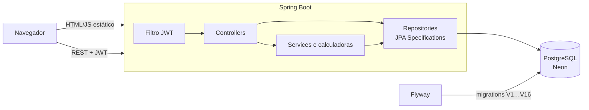
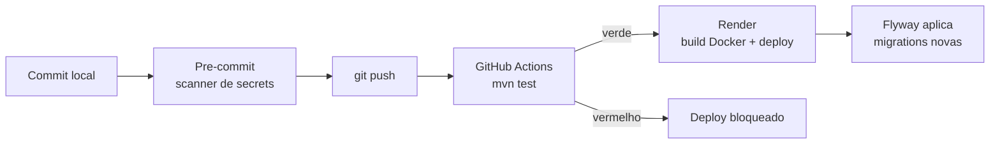
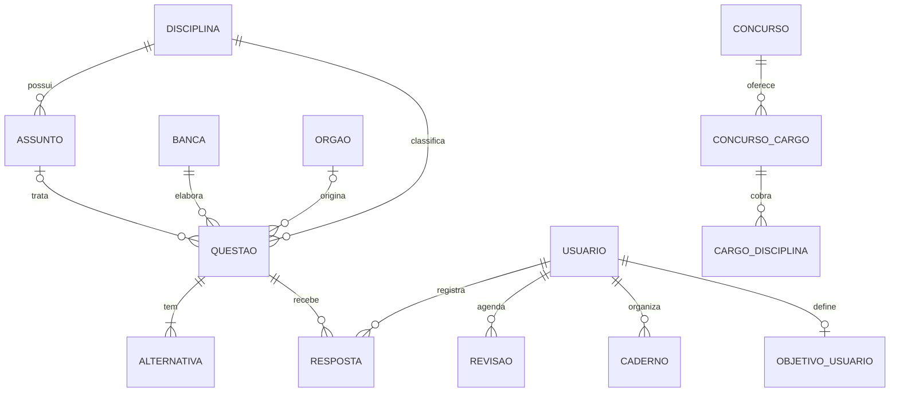

<div align="center">

# 📚 Concursos Platform

**Banco de questões para concursos públicos — filtrar, resolver, revisar no tempo certo e acompanhar a evolução.**

[](https://github.com/gustavoromanno/concursos-platform/actions/workflows/ci.yml)


</div>

---

## Sumário

- [Sobre o projeto](#sobre-o-projeto)
- [Funcionalidades](#funcionalidades)
- [Arquitetura](#arquitetura)
- [Modelo de dados](#modelo-de-dados)
- [Decisões técnicas](#decisões-técnicas)
- [Testes e qualidade](#testes-e-qualidade)
- [API](#api)
- [Rodando localmente](#rodando-localmente)
- [Próximos passos](#próximos-passos)
- [Autor](#autor)

---

## Sobre o projeto

Plataforma no estilo do Qconcursos, construída do zero como projeto pessoal e de portfólio.

A ideia nasceu de uma necessidade real: estudo para concurso e uso esse tipo de plataforma todos os dias. Isso deu clareza sobre o que de fato ajuda quem estuda — **encontrar a questão certa rápido, receber a correção na hora, revisar no momento em que está prestes a esquecer e enxergar onde está errando mais.**

O projeto cobre o ciclo completo de uma aplicação real: modelagem e migrations, API REST com autenticação, regras de negócio testadas, interface web, integração contínua e deploy automatizado.

---

## Funcionalidades

### 🔎 Questões
| Recurso | Detalhe |
|---|---|
| Filtros combináveis | Palavra-chave, disciplina, assunto, banca, órgão, ano, modalidade, "com comentários" e situação pessoal (resolvidas, não resolvidas, certas, erradas) |
| Modalidades | Múltipla escolha e Certo/Errado (formato CESPE) |
| Correção imediata | Resultado e explicação do gabarito logo após responder; a listagem nunca expõe a alternativa correta |
| Comunidade | Estatística de como os outros usuários responderam cada questão e comentários |
| Paginação | 20 por página, ordenação estável |

### 🧠 Estudo
| Recurso | Detalhe |
|---|---|
| Simulado cronometrado | Sorteio por disciplina e banca, correção só no final, resultado por disciplina, encerramento automático quando o tempo acaba |
| Revisão espaçada | Algoritmo SM-2: intervalos de 1 → 6 → 16 → 45 → 126 dias; um erro traz a questão de volta no dia seguinte |
| Organização | Cadernos (listas próprias), marcadores e videoaulas sugeridas pelos assuntos com mais erros |

### 📈 Desempenho
| Recurso | Detalhe |
|---|---|
| Painel | Evolução no tempo, desempenho por disciplina e por assunto, radar de competências |
| Engajamento | Ofensiva (dias seguidos batendo a meta), meta diária editável e mapa de estudo |
| Objetivo de estudo | O usuário escolhe concurso e cargo; progresso e classificação dos assuntos — **dominado · atenção · revisar · vai cair** — são calculados cruzando o histórico com o conteúdo programático |

### 🏛️ Concursos
Catálogo com cronograma de etapas, cargos (vagas e salário), conteúdo programático e provas anteriores resolvíveis na numeração original.

### 🎨 Interface
Menu superior com ícones, modo claro e noturno, layout responsivo — HTML, CSS e JavaScript puros, sem framework nem etapa de build.

---

## Arquitetura



```
src/main/java/com/gustavo/concursos
├── controller      # endpoints REST
├── service         # regras de negócio (SM-2, ofensiva, objetivo)
├── specification   # filtros dinâmicos de questões
├── repository      # Spring Data JPA + consultas nativas
├── entity          # modelo JPA
├── dto             # contratos de entrada e saída da API
└── security        # JWT, filtro de autenticação, SecurityConfig

src/main/resources
├── db/migration    # V1 a V16 (Flyway)
└── static          # frontend (index.html, app.js, style.css)

scripts/gerar_questoes.py   # gera migrations de lotes de questões
```

### Fluxo de entrega



Em desenvolvimento, a aplicação local aponta para um **branch separado do banco** no Neon, isolado dos dados de produção.

---

## Modelo de dados



A **resposta** liga usuário, questão e alternativa escolhida, com data e hora. É a base de todas as estatísticas: acerto por disciplina, evolução, ofensiva, revisão e objetivo.

Questões Certo/Errado usam a mesma tabela de alternativas (duas linhas, "Certo" e "Errado"). Por isso respostas, estatísticas, simulados e revisão funcionam sem nenhum tratamento especial.

---

## Decisões técnicas

**Números derivados, não armazenados.** Ofensiva, progresso do objetivo e contadores são calculados a partir do histórico de respostas. Guardá-los em coluna abriria espaço para divergirem do que realmente aconteceu.

**Regras de negócio em classes puras.** Os cálculos de engajamento e de objetivo ficam em `EngajamentoCalculadora` e `ObjetivoCalculadora`: recebem dados, devolvem resultado, não dependem de banco, relógio nem Spring — por isso são testados em milissegundos. Os controllers só cuidam de HTTP.

**Filtros dinâmicos com Specifications.** Cada filtro é uma `Specification` independente, combinada só quando o parâmetro vem preenchido. Não existe um método de repositório por combinação de filtros.

**Schema versionado e imutável.** O Hibernate roda em `validate`; toda mudança passa por migration do Flyway. Lotes de questões são gerados por script e viram migrations — regerar um lote antigo produz o mesmo arquivo byte a byte, o que protege o checksum do Flyway.

**N+1 sob controle.** `@EntityGraph` na listagem e `default_batch_fetch_size` para as coleções, com `open-in-view` desligado e transações explícitas.

**Segurança.** Sessão stateless com JWT e senhas com BCrypt. A API distingue **401** (não autenticado) de **403** (autenticado sem permissão), e o frontend reage a cada um de forma diferente. Cadastro de conteúdo é restrito ao papel ADMIN. Credenciais vivem só em variáveis de ambiente, e um scanner de secrets no pre-commit já barrou um commit com senha.

**Conteúdo autoral.** As questões são escritas no estilo das bancas, nunca copiadas de provas, que são protegidas por direito autoral. O gabarito de cada lote é distribuído entre as letras para não viciar a resposta.

**Nada de dado inventado na interface.** Se não há dado real por trás, o componente não é construído — filtros e telas só aparecem quando o banco sustenta a informação.

---

## Testes e qualidade

```bash
mvn test
```

Os testes rodam contra **H2 em memória**, sem banco externo, e são executados no **GitHub Actions a cada push**. O deploy só acontece se todos passarem.

| Suíte | O que garante |
|---|---|
| `SegurancaTest` | 401 sem token, com token inválido e com login errado; 403 para usuário comum em rotas de admin |
| `RevisaoServiceTest` | Progressão do SM-2, teto de um ano, limites do fator de facilidade, erro reinicia a contagem |
| `EngajamentoCalculadoraTest` | Ofensiva com dia ainda parcial, buracos e dias abaixo da meta; melhor sequência; intensidade do mapa |
| `ObjetivoCalculadoraTest` | Limites exatos das faixas (80% e 50%), "vai cair" × "revisar", agrupamento por disciplina |
| `QuestaoFiltroTest` | Filtros novos montam consultas válidas e o JSON de paginação mantém o formato usado pela tela |

---

## API

Todas as rotas, exceto `/auth/**` e `/health`, exigem `Authorization: Bearer <token>`.

| Área | Endpoints principais |
|---|---|
| Autenticação | `POST /auth/registrar` · `POST /auth/login` |
| Questões | `GET /questoes` (filtros + paginação) · `POST /questoes/{id}/responder` · `GET /questoes/erradas` |
| Comunidade | `GET/POST /questoes/{id}/comentarios` · `GET /questoes/{id}/estatisticas` |
| Catálogo | `GET /disciplinas` · `GET /bancas` · `GET /orgaos` |
| Simulado | `POST /simulados` · `POST /simulados/{id}/questoes/{questaoId}/responder` · `POST /simulados/{id}/finalizar` |
| Revisão | `GET /revisoes/hoje` · `GET /revisoes/resumo` |
| Desempenho | `GET /estatisticas` · `GET /estatisticas/assuntos` · `GET /estatisticas/evolucao` |
| Engajamento | `GET /engajamento` · `PUT /engajamento/meta` · `GET /engajamento/mapa` |
| Objetivo | `GET/PUT/DELETE /objetivo` |
| Organização | `/cadernos` · `/marcadores` · `/videoaulas` |
| Concursos | `GET /concursos` · `GET /concursos/{id}` · `GET /provas/{id}` |
| Admin | `POST /questoes` · `DELETE /questoes/{id}` · `POST/DELETE /concursos…` · `POST/DELETE /videoaulas` |

Exemplo de busca:

```http
GET /questoes?disciplinaId=4&tipo=CERTO_ERRADO&situacao=ERRADAS&page=0&size=20&sort=id
```

---

## Rodando localmente

**Pré-requisitos:** JDK 21, Maven 3.9+ e um PostgreSQL (local ou gerenciado).

1. Defina as variáveis de ambiente:

```
DB_URL       = jdbc:postgresql://host/banco?sslmode=require
DB_USERNAME  = usuario
DB_PASSWORD  = senha
JWT_SECRET   = string-aleatoria-com-no-minimo-64-caracteres
```

2. Suba a aplicação:

```bash
mvn spring-boot:run
```

O Flyway cria o schema e carrega o conteúdo inicial na primeira execução. Acesse `http://localhost:8080`.

3. Para gerar um novo lote de questões:

```bash
python scripts/gerar_questoes.py <lote> src/main/resources/db/migration/V<n>__lote_questoes_<lote>.sql
```

---

## Próximos passos

- [ ] Anotações pessoais em cada questão
- [ ] Dificuldade calculada pela taxa de acerto da comunidade
- [ ] Novos lotes de questões vinculadas a órgãos
- [ ] Migração para Spring Boot 4

---

## Autor

**Gustavo Romano** — estudante de Engenharia de Software e analista de suporte técnico em ERP.

[LinkedIn](https://linkedin.com/in/gustavoromanno) · [GitHub](https://github.com/gustavoromanno)
